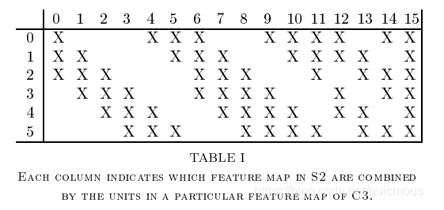

lenet5基本结构包括7层网络结构(不含输入层)，其中包括2个卷积层、2个池化层，2个全连接层

[论文笔记：Gradient-Based Learning Applied to Document Recognition-CSDN博客](https://blog.csdn.net/quicmous/article/details/105730556)

1. 输入层(input layer)

输入层接收大小为 32×32 的手写数字图像，其中包括[灰度值](https://zhida.zhihu.com/search?content_id=225241300&content_type=Article&match_order=1&q=灰度值&zhida_source=entity)（0-255）。在实际应用中，我们通常会对输入图像进行预处理，例如对像素值进行[归一化](https://zhida.zhihu.com/search?content_id=225241300&content_type=Article&match_order=1&q=归一化&zhida_source=entity)，以加快训练速度和提高模型的准确性。

2. 卷积层C1（Convolutional layer C1）

卷积层C1包括6个卷积核，每个卷积核的大小为 5×5 ，步长为1，填充为0。因此，每个卷积核会产生一个大小为 28×28 的特征图（输出通道数为6）。

3. 采样层S2（Subsampling layer S2）

采样层S2采用最大池化（max-pooling）操作，每个窗口的大小为 2×2 ，步长为2。因此，每个[池化操作](https://zhida.zhihu.com/search?content_id=225241300&content_type=Article&match_order=1&q=池化操作&zhida_source=entity)会从4个相邻的特征图中选择最大值，产生一个大小为 14×14 的特征图（输出通道数为6）。这样可以减少特征图的大小，提高计算效率，并且对于轻微的位置变化可以保持一定的不变性。

4. 卷积层C3（Convolutional layer C3）

卷积层C3包括16个卷积核，每个卷积核的大小为 5×5 ，步长为1，填充为0。因此，每个卷积核会产生一个大小为 10×10 的特征图（输出通道数为16）。

C3的前六个特征图(0,1,2,3,4,5)由S2的相邻三个特征图作为输入，接下来的6个特征图(6,7,8,9,10,11)由S2的相邻四个特征图作为输入，12,13,14号特征图由S2间断的四个特征图作为输入，15号特征图由S2全部(6个)特征图作为输入。

### 输入特征图 (S2 层): 0, 1, 2, 3, 4, 5

总共有 6 个输入特征图。

### 输出特征图 (C3 层): 0 ~ 15 (共 16 个特征图)

1. **C3[0] ~ C3[5]:**

   - 每个输出特征图由 **S2 的相邻 3 个特征图**作为输入。
   - 具体映射关系如下：
     - C3[0] 由 S2[0], S2[1], S2[2] 生成。
     - C3[1] 由 S2[1], S2[2], S2[3] 生成。
     - C3[2] 由 S2[2], S2[3], S2[4] 生成。
     - C3[3] 由 S2[3], S2[4], S2[5] 生成。
     - C3[4] 由 S2[4], S2[5], S2[0] 生成（循环连接）。
     - C3[5] 由 S2[5], S2[0], S2[1] 生成（循环连接）。

2. **C3[6] ~ C3[11]:**

   - 每个输出特征图由 **S2 的相邻 4 个特征图**作为输入。
   - 具体映射关系如下：
     - C3[6] 由 S2[0], S2[1], S2[2], S2[3] 生成。
     - C3[7] 由 S2[1], S2[2], S2[3], S2[4] 生成。
     - C3[8] 由 S2[2], S2[3], S2[4], S2[5] 生成。
     - C3[9] 由 S2[3], S2[4], S2[5], S2[0] 生成（循环连接）。
     - C3[10] 由 S2[4], S2[5], S2[0], S2[1] 生成（循环连接）。
     - C3[11] 由 S2[5], S2[0], S2[1], S2[2] 生成（循环连接）。

3. **C3[12] ~ C3[14]:**

   - 每个输出特征图由 **S2 的间隔 4 个特征图**作为输入。
   - 具体映射关系如下：
     - C3[12] 由 S2[0], S2[2], S2[4], S2[1] 生成。
     - C3[13] 由 S2[1], S2[3], S2[5], S2[0] 生成。
     - C3[14] 由 S2[2], S2[4], S2[0], S2[1] 生成。

4. **C3[15]:**

   - 由 

     S2 的所有 6 个特征图

     作为输入：

     - C3[15] 由 S2[0], S2[1], S2[2], S2[3], S2[4], S2[5] 生成。

5. 采样层S4（Subsampling layer S4）

采样层S4采用最大池化操作，每个窗口的大小为 2×2 ，步长为2。因此，每个池化操作会从4个相邻的特征图中选择最大值，产生一个大小为 5×5 的特征图（输出通道数为16）。

6. 全连接层C5（Fully connected layer C5）

C5将每个大小为 5×5 的特征图拉成一个长度为400的向量，并通过一个带有120个神经元的全连接层进行连接。120是由LeNet-5的设计者根据实验得到的最佳值。

7. 全连接层F6（Fully connected layer F6）

全连接层F6将120个神经元连接到84个神经元。

8. 输出层（Output layer）

输出层由10个神经元组成，每个神经元对应0-9中的一个数字，并输出最终的分类结果。在训练过程中，使用[交叉熵损失函数](https://zhida.zhihu.com/search?content_id=225241300&content_type=Article&match_order=1&q=交叉熵损失函数&zhida_source=entity)计算输出层的误差，并通过反向传播算法更新卷积核和全连接层的权重参数。